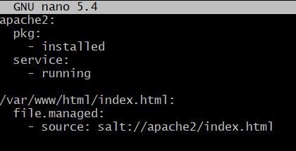
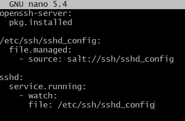
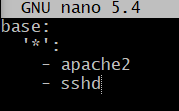

# ServerManagementProject

Mini Project for Tero Karvinen's Server Management ICT4TN022-3014 - 2021 course

In this project I will attempt to make a salt state, which I can use to install, run and manage some useful everyday programs. 

With this, if I ever install a new machine(slave) for which I want these programs up and running, this state will do so with essentially a single command from master.


## Top.sls

First to create sls files for wanted programs

On Master create a new directory for your state file. This was for Apache, so I did /srv/salt/Apache2

Within that directory create a new init.sls file.

Inside will be the configurations, in my case this was the Apache 2 file, which looked like this:



Repeat this process for other programs, so that the directories containing sls files are all under the same directory; in my case /srv/salt

For my other program I used ssh whose init.sls was the following:



Naturally test your configurations are working properly, so I tested these two states locally:

```
$ sudo salt-call --local state.apply apache2
```

```
$ sudo salt-call --local state.apply sshd
```

Next create a top.sls file in /srv/salt, mine came out like this:



And finally to run on slaves: 

```
sudo salt '*' state.highstate
```

Succesful


 
